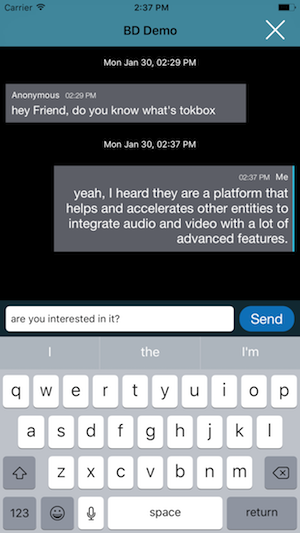

[](https://travis-ci.org/opentok/accelerator-textchat-ios)
[](https://cocoapods.org/pods/OTTextChatAccelerator)
[](https://cocoapods.org/pods/OTTextChatAccelerator)
[](https://cocoapods.org/pods/OTTextChatAccelerator)
[](http://makeapullrequest.com)
[](https://codebeat.co/projects/github-com-opentok-accelerator-textchat-ios)

# Text Chat Accelerator Pack iOS <br/>

The Text Chat Accelerator Pack provides functionality you can add to your OpenTok applications that enables users to exchange text messages between mobile or browser-based devices.

# Text Chat Accelerator Pack Examples <br/>

 

# Configure, build and run the sample app <br/>

1. Get values for **API Key**, **Session ID**, and **Token**. See [Obtaining OpenTok Credentials](#obtaining-opentok-credentials) for important information.

1. Install CocoaPods as described in [CocoaPods Getting Started](https://guides.cocoapods.org/using/getting-started.html#getting-started). If you are only interested in the core part without UI component, you can use this `pod 'OTTextChatAccelerator/Core'`

1. In Terminal, `cd` to your project directory and type `pod install`.

1. Reopen your project in Xcode using the new `*.xcworkspace` file.

1. Replace the following empty strings with the corresponding API Key, Session ID, and Token values:

    ```objc
    - (BOOL)application:(UIApplication *)application didFinishLaunchingWithOptions:(NSDictionary *)launchOptions {
        // Override point for customization after application launch.
        sharedSession = [[OTAcceleratorSession alloc] initWithOpenTokApiKey:@"apikey" sessionId:@"sessionid" token:@"token"];
        return YES;
    }
    ```

1. Use Xcode to build and run the app on an iOS simulator or device.

1. For testing text chat, we include a simple web app to make it easier: [Browser-Demo-TextChat](https://github.com/opentok/accelerator-textchat-ios/blob/master/browser-demo-textchat.html). Simply open it and replace the corresponding API Key, Session ID, and Token values. Then save and load it to the browser.

1. You might want to run on other platforms:

[Accelerator Textchat Javascript](https://github.com/opentok/accelerator-textchat-js) <br />
[Accelerator Textchat Android](https://github.com/opentok/accelerator-textchat-android)

# Sample Codes

- Passing the session

    ```objc
    - (OTAcceleratorSession *)sessionOfOTOneToOneCommunicator:(OTOneToOneCommunicator *)oneToOneCommunicator {
        return <#OTAcceleratorSession#>;
    }
    ```

- Start signaling text chat data

    ```objc
    // we assume self owns a table tableView
    [self.textChat connectWithHandler:^(OTTextChatConnectionEventSignal signal, OTConnection *connection, NSError *error) {
        if (signal == OTTextChatConnectionEventSignalDidConnect) {
            NSLog(@"Text Chat starts");
        }
        else if (signal == OTTextChatConnectionEventSignalDidDisconnect) {
            NSLog(@"Text Chat stops");
        }
    } messageHandler:^(OTTextChatMessageEventSignal signal, OTTextMessage *message, NSError *error) {
        if (signal == OTTextChatMessageEventSignalDidSendMessage || signal == OTTextChatMessageEventSignalDidReceiveMessage) {
            if (!error) {
                [weakSelf.textMessages addObject:message];
                [weakSelf.tableView reloadData];
            }
        }
    }];
    ```

- Stop signaling text chat data

    ```objc
    [self.textchat disconnect];
    ```

####Obtaining OpenTok Credentials

To use OpenTok's framework you need a Session ID, Token, and API Key you can get these values at the [OpenTok Developer Dashboard](https://dashboard.tokbox.com/) . For production deployment, you must generate the Session ID and Token values using one of the [OpenTok Server SDKs](https://tokbox.com/developer/sdks/server/).

# JSON Requirements for Text Chat Signaling

The JSON used when using the OpenTok signaling API with the OpenTok Text Chat component describes the information used when submitting a chat message. This information includes the date, chat message text, sender alias, and sender ID. The JSON is formatted as shown in this example:

``` javascript
// var type = "text-chat"
```

```json
{
    "sentOn" : 1462396461923.305,
    "text" : "Hi",
    "sender" : {
        "alias" : "Tokboxer",
        "id" : "16FEB40D-C09B-4491-A983-44677B7EBB3E"
    }
}
```

This formatted JSON is converted to a string, which is submitted to the OpenTok signaling API. For more information, see:

- [Signaling - JavaScript](https://tokbox.com/developer/guides/signaling/js/)
- [Signaling - iOS](https://tokbox.com/developer/guides/signaling/ios/)
- [Signaling - Android](https://tokbox.com/developer/guides/signaling/android/)
