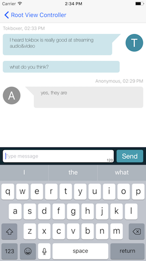

[](https://travis-ci.com/opentok/accelerator-textchat-ios)
[](http://makeapullrequest.com)

# Text Chat Accelerator Pack iOS <br/>

The Text Chat Accelerator Pack provides functionality you can add to your OpenTok applications that enables users to exchange text messages between mobile or browser-based devices.

# Text Chat Accelerator Pack Examples <br/>

 

# Configure, build and run the sample app <br/>

1. Get values for **API Key**, **Session ID**, and **Token**. See [Obtaining OpenTok Credentials](#obtaining-opentok-credentials) for important information.

1. Replace the following empty strings with the corresponding API Key, Session ID, and Token values:

    ```objc
    - (BOOL)application:(UIApplication *)application didFinishLaunchingWithOptions:(NSDictionary *)launchOptions {
        // Override point for customization after application launch.
        sharedSession = [[OTAcceleratorSession alloc] initWithOpenTokApiKey:@"apikey" sessionId:@"sessionid" token:@"token"];
        return YES;
    }
    ```

1. Use Xcode to build and run the app on an iOS simulator or device.

1. By using Xcode, you can run a simulator and a device at the same time for 1-1 communication. For multiparty call, you might want to run on other platforms:

[Accelerator Textchat Javascript](https://github.com/opentok/accelerator-textchat-js) <br />
[Accelerator Textchat Android](https://github.com/opentok/accelerator-textchat-android)

####Obtaining OpenTok Credentials

To use OpenTok's framework you need a Session ID, Token, and API Key you can get these values at the [OpenTok Developer Dashboard](https://dashboard.tokbox.com/) . For production deployment, you must generate the Session ID and Token values using one of the [OpenTok Server SDKs](https://tokbox.com/developer/sdks/server/).

## JSON Requirements for Text Chat Signaling

The JSON used when using the OpenTok signaling API with the OpenTok Text Chat component describes the information used when submitting a chat message. This information includes the date, chat message text, sender alias, and sender ID. The JSON is formatted as shown in this example:

```json
{
    "sentOn" : 1462396461923.305,
    "text" : "Hi",
    "sender" : {
        "alias" : "Tokboxer",
        "id" : "16FEB40D-C09B-4491-A983-44677B7EBB3E"
    }
}
```

This formatted JSON is converted to a string, which is submitted to the OpenTok signaling API. For more information, see:

- [Signaling - JavaScript](https://tokbox.com/developer/guides/signaling/js/)
- [Signaling - iOS](https://tokbox.com/developer/guides/signaling/ios/)
- [Signaling - Android](https://tokbox.com/developer/guides/signaling/android/)
